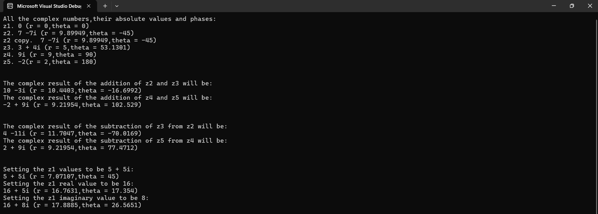

# OOP-Complex-Numbers

This repository contains a professional C++ implementation of a **Complex Numbers** library, developed using Object-Oriented Programming (OOP) principles. The project focuses on modularity, encapsulation, and accurate mathematical representations.

## Features
* **Encapsulation**: Private data members (`_re`, `_im`) accessed via secure getters and setters to ensure data integrity.
* **Constructors**: Includes default, parameterized, and copy constructors for flexible object initialization.
* **Mathematical Operations**:
    * **Arithmetic**: Support for adding and subtracting complex numbers.
    * **Polar Representation**: Built-in functions to calculate the Absolute Value (magnitude) and Phase (angle in degrees).
* **Formatted Output**: A specialized `print()` function that handles various cases (e.g., zero real/imaginary parts, negative values) to ensure a clean and professional mathematical display.

## Mathematical Formulas Used
* **Absolute Value (Magnitude)**: $r = \sqrt{re^2 + im^2}$
* **Phase (Degrees)**: $\theta = \text{atan2}(im, re) \cdot \left(\frac{180}{\pi}\right)$

## Example Usage
The following example demonstrates how to initialize numbers, perform calculations, and display results using the library:

```cpp
#include "Complex.h"
#include <iostream>

int main() {
    // 1. Initialize complex numbers using different constructors
    Complex z1;             // Default: 0 + 0i
    Complex z2(7, -7);      // Parameterized: 7 - 7i
    Complex z3(3, 4);       // Parameterized: 3 + 4i
    Complex z2c(z2);        // Copy constructor

    // 2. Perform addition and subtraction
    Complex sum = z2.add(z3); 
    Complex diff = z2.sub(z3);

    // 3. Display results using the custom print function
    std::cout << "z2 + z3 = "; 
    sum.print(); // Expected Output: 10 - 3i (with magnitude and phase)

    std::cout << "z2 - z3 = "; 
    diff.print(); // Expected Output: 4 - 11i

    // 4. Accessing properties and updating values
    z1.setComplex(5, 5);
    std::cout << "\nNew z1 values: ";
    z1.print();
    
    std::cout << "z1 Magnitude: " << z1.abValue() << std::endl;
    std::cout << "z1 Phase: " << z1.phase() << " degrees" << std::endl;

    return 0;
}
```

## Execution Screenshot
Below is a screenshot of the library in action:



